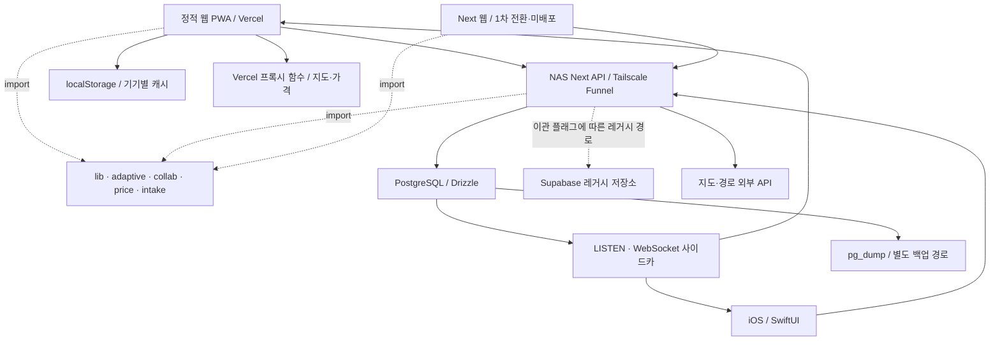

# 시스템 구성과 점진적 모듈 구조

2026-09-08 코드 기준. NAS가 운영 API라는 사실은 배포 문서와 클라이언트 기본 주소에서 확인했다. NAS 읽기 전용 확인에서 API·실시간·DB healthy, backup Up, TRIP·COLLAB·ADAPTIVE·PRICING=NEW_BACKEND를 확인했다. 자세한 범위는 개선 검토의 운영 확인 기록에 있다. 오프사이트 복제는 미확인이다.

## 구성요소와 장애 경계

| 구성요소 | 책임·상태 | 배포·설정 | 장애 시 영향 / 소스 |
|---|---|---|---|
| 정적 PWA | 편집·지도·로컬 문서·동기화 메타데이터·로컬 추천 거절 이력 | Vercel / 앱 셸 버전 | 캐시된 셸·로컬 편집은 남지만 서버 저장은 별개. `app.js`, `sw.js`, `api.js` |
| Next 웹 | 별도 React 화면과 로컬 저장·공통 API 동기화 | 이관 워크스페이스. 루트 Vercel `/next`는 `/`로 리다이렉트 | 인증·저장 1차 전환 검증. 협업·PWA 동등성은 미완료. `next/src/features/cloud/`, `vercel.json` |
| iOS | API 결과 표시, JSONValue 문서 편집, Keychain 세션, 응답 캐시 | 앱 배포 / `TCApiBaseURL` | 읽기 캐시 범위 밖은 API 필요. 실패한 쓰기를 웹의 오프라인 큐와 동일시하지 않음. `ios/TripCanvas/Services/TripService.swift`, `Core/Networking/`, `Core/Models/JSONValue.swift` |
| API | 인증·검증·도메인 결과·권한·여행 저장 조립 | NAS `api` 이미지 | 로그인·공유 저장·서버 판단 중단. `next/src/app/api/v1/route-deps.ts` |
| PostgreSQL | JSONB 여행+revision, 멤버, 자체 인증 세션, 이력, 가격, 구간 캐시 | NAS 볼륨 / `migrate` | API와 실시간 모두 영향. `next/src/server/infrastructure/database/schema.ts` |
| 실시간 | 커밋된 활동을 갱신 신호로 전달. 문서 본문은 API 재조회 | NAS `realtime` 이미지 / 공개 WS 주소 | 갱신 신호 지연. API 재조회 경로는 유지. `next/src/server/realtime/`, `app.js`의 `startLive`, iOS `RealtimeClient.swift` |
| 백업 | 성공한 custom 덤프 보관, 실패 후 5분 재시도 | NAS `backup` / 외부 복제는 NAS 별도 설정 | 컨테이너 Up만으로 최근 백업·외부 복제를 보장하지 않음. `deploy/backup.sh` |
| Vercel 함수 | 지도·가격 프록시와 NAS 외부 경로 점검 | 웹과 함께 배포 | 지도·가격 일부 기능 또는 외부 점검 영향. `api/`, `vercel.json` |

## 요청과 저장

정적 웹의 로그인은 `auth.js`가 `/api/v1/auth-config`를 확인해 자체 인증 또는 레거시 인증을 선택한다. 여행·가격·협업 저장은 `api.js`를 통해 API로 간다. iOS는 자체 인증 세션을 사용한다. Next 웹의 `useCloudAuth.ts`, `cloudSync.ts`, `tripSnapshots.ts`도 1차 전환 코드에서 공통 인증·API transport를 사용한다(미배포). 기존 Supabase 직접 접근은 전환 전 구현이다.

NAS 새 저장소 경로는 인증 → 라우트 검증 → 서비스의 권한 검사 → Repository의 트랜잭션·revision CAS 순서다. 여행은 JSONB 문서 전체를 저장한다. 클라이언트가 다른 기기의 revision을 덮어쓰려 하면 충돌을 반환한다. 이 방식은 서로 다른 장소의 동시 수정에도 충돌할 수 있지만, 현재 작업에서 빈도는 측정하지 않았다. [백엔드 상세](backend-architecture.md)

활동 INSERT → PostgreSQL NOTIFY → 사이드카 LISTEN → 구독 권한 확인 → WebSocket 신호 → 클라이언트 API 재조회 순서로 갱신된다. `/me`의 실제 선택은 `COLLAB` 플래그와 `REALTIME_URL`에 달려 있다. `REALTIME` 플래그 이름만으로 활성화를 판단하지 않는다.

## 같은 엔진, 다른 입력

| 입력 | 정적 웹 | API / iOS가 받는 결과 | 의미 |
|---|---|---|---|
| 시각 | `travelClock()`의 기기 현지 날짜·시각 | `resolveClock()`의 일자/여행 시간대, 없으면 UTC; 쿼리 재정의 가능 | 시간대가 다르면 같은 순간에도 결과가 다를 수 있음 |
| 이동시간 | 브라우저 `legCache` | DB 구간 캐시 + 서버 조회, 실패·미설정 시 추정 | 엔진 공통화가 캐시 공통화를 의미하지 않음 |
| 추천 거절 | localStorage, 기기별·날짜별 | Gateway가 고른 저장소의 사용자별 기록 | 다른 기기에서 같은 제안이 보일 수 있음 |
| 출발점·타임라인 | `dayContext()` → `adaptState()` | `dayStartAnchor()`·`computeTimeline()` → `computeToday()` | 같은 순수 함수와 입력 계약을 유지 |

이 차이는 별도 엔진을 추가해서 해결하지 않는다. 여행 시간대 우선 정책과 거절 이력 공유 범위를 결정한 뒤 입력 배선을 통일한다. 계약 필드 검사는 `swiftParity.test.ts`, 실제 Swift 디코딩은 XCTest가 담당한다. 필드 검사 통과만으로 실기기 동작까지 검증됐다고 쓰지 않는다.

## 운영 확인이 남은 항목

- NAS 각 이미지의 실제 버전과 마이그레이션 이력, 도메인별 이관 플래그.
- Supabase 구형 클라이언트·토큰의 실제 사용량과 신규 DB 전수 이관 완료 근거.
- 백업의 최신 성공 시각, 외부 복제, 실제 운영 덤프의 복구 시간, 장애 알림 수신 경로.
- 웹·앱 외부 API 키 제한과 실기기 로그인·저장·실시간 갱신.

이관 분기 종료·웹 비교·검증 결과는 [시스템 개선 검토](system-architecture-review.md), 배포 순서는 [NAS 릴리스 절차](nas-release.md)를 따른다.

## 정적 웹 모듈

Trip Canvas는 빌드 단계 없이 classic script를 순서대로 로드한다. 의존성 방향은 아래와 같다.

1. `lib.js`: 데이터 정규화, 시간, 거리, 앵커, 타임라인 같은 순수 도메인 함수
2. `adaptive.js`: 판단 엔진(오늘·제안·재구성·출발 안내). DOM·네트워크·현재시각을 모르고 전부 인자로 받는다 — **웹과 iOS가 같은 답을 받는 단일 출처**이고 `/api/v1`이 그대로 import한다
3. `collab.js` · `intake.js` · `price.js`: 협업 판정 · 유입 파싱 · 가격 계산 (전부 순수)
4. `sync.js`: revision 병합과 삭제/undo 상태 전이
5. `routing.js`: Google/Kakao HTTP transport와 fallback; `lib.js` 함수와 `fetch`는 factory 인자로 주입
6. `api.js` · `auth.js`: TripCanvas API·인증 클라이언트. `{data,error}`를 돌려주고 예외를 던지지 않으며, 제공자별 실패를 **코드**로 옮겨 화면이 제공자를 모르게 한다
7. `app.js`: 위 모듈을 조합하고 DOM, 지도 SDK, localStorage를 담당

`routing.js`는 지도나 DOM 전역을 직접 읽지 않아 mock fetch로 단위 테스트할 수 있다. `sync.js`의 병합 함수도 네트워크 없이 테스트한다. 이 경계 덕분에 네트워크 실패와 UI 렌더링 실패를 서로 분리해 진단할 수 있다.

현재 `app.js`의 기존 호출부를 작게 유지하기 위해 factory 결과의 `fetchLeg`을 같은 이름의 lexical shim으로 노출한다. 다음 단계에서 `app.js` 자체를 ES module로 전환할 때 명시적 import로 바꾸고 이 shim을 제거한다. 지도 SDK·inline handler가 전역 함수에 의존하므로 한 번에 module 전환하지 않는다.

### Next 웹 전환 상태 (2026-09-08, 미배포)

Next를 최종 웹으로 선택했다. 1차 전환 코드에서 `features/cloud`는 공통 `auth.js`·`api.js`를 통해 자체 인증과 `/api/v1` 저장·이력·가격 관측 읽기를 사용한다. 협업·실시간·PWA 동등성 확보 후 운영 전환하며 상세 검증과 잔여 범위는 [개선 검토](system-architecture-review.md#next-웹-1차-전환-결과)에 기록한다.
