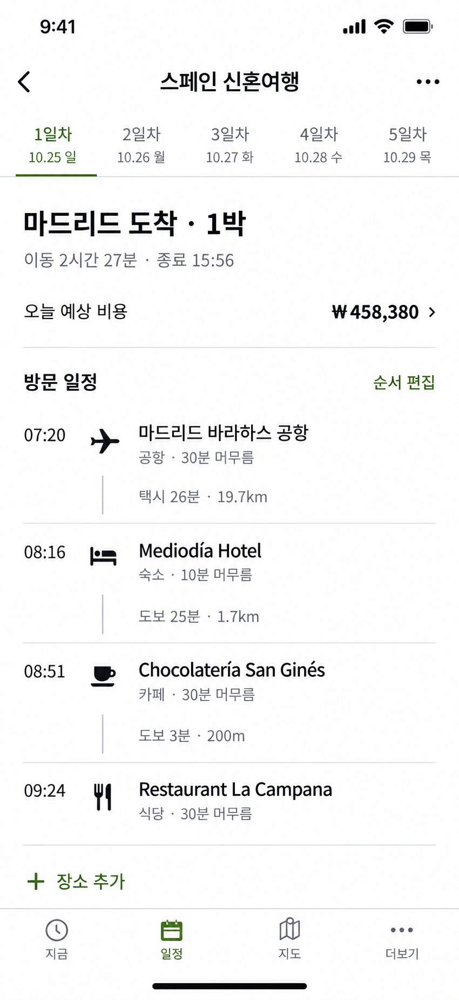

# With J iOS 일정 목록 디자인 적용 프롬프트

## 작업 요청

현재 저장소의 SwiftUI iOS 앱에서 일정 목록 화면을 아래 승인 시안에 맞춰 구현해 주세요. 사용자에게 승인받은 방향은 **사진 없는 목록형 일정, 왼쪽 도착 시각, 작은 카테고리 아이콘, 장소명**입니다. 시안의 예시 데이터를 하드코딩하지 말고 실제 여행 데이터로 같은 구성을 구현하세요.

기준 이미지: [승인 시안](design-references/ios-itinerary-left-time-approved.png)

이미지는 정보 배치와 시각 스타일의 기준입니다. 기존 기능·권한·데이터 의미와 접근성이 이미지보다 우선합니다. 이미지에 안 보이는 기능을 삭제하지 마세요. 이번 작업은 구현과 로컬 검증까지이며, 프로덕션 머지·NAS 배포·TestFlight 배포는 별도 요청을 받기 전 실행하지 마세요.

## 먼저 확인할 코드와 진행 순서

1. `AGENTS.md`, `ios/README.md`와 실제 작업 디렉터리 지침을 읽고 현재 변경 사항과 원격 상태를 확인하세요. 사용자 변경을 보존하고 저장소 규칙에 맞는 작업 브랜치를 사용하세요.
2. 아래 파일 및 연결된 데이터·화면 경로를 읽고, 변경 범위와 보존할 동작을 간단히 설명하세요.
   - `ios/TripCanvas/Features/Plan/TripPlanView.swift`: 툴바, 시트, 편집 상태, 비용 진입
   - `ios/TripCanvas/Features/Plan/PlanDayPicker.swift`: 날짜 선택
   - `ios/TripCanvas/Features/Plan/PlanSpotList.swift`: 요약, 목록, 순서 변경, 날짜 스와이프
   - `ios/TripCanvas/Features/Plan/SpotRow.swift`: 장소·시간·이동 구간 표시
   - `ios/TripCanvas/Features/Trips/TripHomeView.swift`: 여행 제목과 하단 탭
   - `ios/TripCanvas/DesignSystem/DesignSystem.swift`: 기존 색상·타이포그래피·간격
3. 필요한 화면만 수정하고 빌드 및 기존 관련 테스트로 검증하세요.
4. 시뮬레이터에서 실제 구현 화면을 캡처해 승인 이미지와 비교하고, 차이와 검증 결과를 보고하세요. 생성형 이미지로 구현 결과를 대신하지 마세요.

## 화면 구성

### 상단과 날짜 선택

- 상단은 뒤로 가기, 여행명, 일정 메뉴를 간결하게 배치합니다. 긴 여행명은 시스템 내비게이션 제약에 맞춰 처리합니다.
- 날짜는 가로 스크롤 가능한 두 줄 탭으로 표시합니다. 예: `1일차` / `10.25 일`.
- 선택한 날은 올리브 색과 밑줄로 구분합니다. 날짜가 많은 여행, 연도 전환, 날짜 미정 상태도 기존 데이터 규칙으로 처리합니다.
- 날짜 탭과 스와이프는 같은 선택 상태를 사용하며, 선택한 날짜가 보이는 위치로 이동해야 합니다.

### 하루 요약

- 하루 제목은 시스템 산세리프 글꼴로 표시합니다. 예: `마드리드 도착 · 1박`. 숙박 정보는 실제 데이터에 있을 때만 표시합니다.
- 아래 한 줄에 총 이동 시간과 종료 예상 시각을 표시합니다. 공간이 부족하면 자연스럽게 줄을 나눕니다.
- 별도 비용 행은 왼쪽 `오늘 예상 비용`, 오른쪽 금액과 상세 진입 표시로 구성합니다. 현재 선택한 날의 기존 비용 화면으로 연결합니다.
- 계산 중·실패·금액 미정·추정값을 정상 확정값처럼 표시하지 않습니다. 금액이 없으면 0원으로 꾸미지 않습니다.
- 기존 상세 요약, 하루 기본 이동수단 변경, 경고·예약 충돌 안내는 요약 펼침이나 기존 메뉴 등 명확한 진입점으로 유지합니다. 시안에서 생략됐다는 이유로 제거하지 않습니다.

### 장소 목록 — 이번 변경의 핵심

- `방문 일정` 제목과 오른쪽 `순서 편집`을 배치합니다. 편집 중에는 `완료`로 바꾸며 기존 편집 상태와 연결합니다. 별도의 경쟁하는 편집 상태를 만들지 않습니다.
- 장소 행의 순서는 **도착 시각 → 카테고리 아이콘 → 장소명**입니다. 오른쪽 끝에 도착 시각을 중복 표시하지 않습니다.
- 왼쪽 시간 열은 동일한 너비를 사용하고 숫자는 고정폭 숫자 스타일로 정렬합니다. 예상 도착·고정 도착·예약 시각의 의미를 보존하고 필요한 라벨 또는 기호로 구분합니다.
- 장소 카테고리 아이콘은 기존 분류와 SF Symbols를 활용합니다. 번호 원형 타임라인이나 사진·썸네일을 추가하지 않습니다.
- 장소명 아래 보조 정보는 `숙소 · 10분 머무름`처럼 핵심 정보부터 표시합니다. 기존 예약·미정·상태·분리 일정 등 의미 있는 표시를 일괄 삭제하지 않습니다.
- 긴 한국어·외국어 장소명은 줄바꿈합니다. 시간을 밀어내거나 중요한 이름을 무조건 한 줄로 자르지 않습니다.
- 이동 정보는 해당 출발 장소와 다음 도착 장소 사이에 작고 차분하게 표시합니다. 예: `택시 26분 · 19.7km`. 기존 계산 결과가 도착 장소에 연결돼 있더라도 실제 연결 관계를 확인해서 표시하세요. 첫 장소 앞의 이월 출발 구간과 마지막 복귀 구간도 구분합니다.
- 얇은 구분선과 절제된 연결선을 사용합니다. 큰 회색 카드나 과도한 행 간 공백은 피합니다.
- 목록 하단의 `+ 장소 추가`는 왼쪽 정렬된 텍스트 동작으로 표시하고 기존 검색·직접 입력 흐름을 유지합니다. 빈 일정에서도 추가 진입점이 있어야 합니다.

### 탭과 스타일

- 하단 `지금 / 일정 / 지도 / 더보기` 구성과 일정의 목록 기본 화면을 유지합니다.
- 밝은 배경, 짙은 본문, 중간 명도의 보조 텍스트, 올리브 강조색을 사용합니다. 기존 iOS 디자인 토큰부터 확인하고 일정 화면에 필요한 범위만 조정합니다.
- 그림자·그라데이션·장식용 카드·명조 제목을 추가하지 않습니다. 다른 화면까지 전역 스타일을 바꾸지 않습니다.
- 기본 가이드: 좌우 여백 약 20pt, 시간 열 약 48~56pt, 아이콘 약 20~24pt, 본문 약 16~17pt, 보조 정보 약 13~14pt. 이는 고정 높이 제한이 아니며 Dynamic Type에서 확장돼야 합니다.
- 모든 조작 영역은 최소 44×44pt를 확보합니다. 색상만으로 선택이나 경고를 전달하지 않습니다. VoiceOver에서 시간·장소·상태·이동 정보가 논리적인 순서로 읽히게 합니다.

## 보존해야 할 기능과 기술 경계

- API 계약, 서버 계산 엔진, 저장 문서 형식과 비용·숙박 배분·환율 계산은 바꾸지 않습니다. iOS에 계산 규칙을 복제하지 않습니다.
- 장소 추가·수정·삭제·순서 변경·날짜 이동·여러 장소 선택·되돌리기와 소유자/편집자/보기 권한을 보존합니다.
- 툴바를 간결하게 바꾸더라도 기존 여행 전체 개요·설정·검색·직접 입력 기능을 이용할 수 있어야 합니다. 지도 탭에서 공유하는 툴바와 날짜 선택에 미치는 영향을 확인합니다.
- 가로 날짜 스와이프와 세로 스크롤의 방향 판정, 드래그 도중 장소 편집이 열리지 않는 탭 취소 처리를 유지합니다.
- 실제 장소 배열과 재정렬 인덱스의 대응을 보존합니다. 이동 설명·이월 숙소·렌터카 픽업/반납·숙소 복귀를 실제 장소로 취급해 순서가 깨지지 않게 합니다.
- 저장 후 재계산 때 기존 목록을 유지합니다. 무한 로딩이나 다른 날짜를 방문해야 갱신되는 문제를 재발시키지 않습니다. 저장 실패 복구와 충돌 처리도 유지합니다.
- 화면 상태와 시트의 기존 소유 구조를 따릅니다. 디자인 변경을 이유로 대규모 리팩토링, 새 외부 의존성, 웹·서버 변경을 추가하지 않습니다.

## 검증과 완료 기준

- 먼저 승인 시안과 같은 구성의 합성 여행으로 비교합니다. 운영 사용자 데이터를 수정하지 않습니다.
- 작은 iPhone과 일반 크기 iPhone, 큰 글자 설정에서 시간·아이콘·긴 장소명이 겹치지 않고 버튼을 누를 수 있어야 합니다. 기존 다크 모드 지원이 있으면 가독성을 유지합니다.
- 빈 날, 장소 1개, 긴 목록, 시간 미정, 계산 중/실패, 고정 시각, 예약 시각, 전날 숙소 이월·복귀·렌터카 구간을 확인합니다.
- 날짜 탭 및 좌우 스와이프, 세로 스크롤, 장소 탭, 순서 편집, 추가·저장 후 즉시 갱신, 하루 비용 진입을 실제로 조작해 확인합니다. 보기 권한에서는 편집 진입이 없어야 합니다.
- 기존 관련 XCTest와 저장소 iOS 검증 절차(`scripts/verify-all.sh ios`)를 실행합니다. 단순 스타일 수치를 그대로 복제하는 테스트는 추가하지 말고, 변경한 상호작용에 회귀 위험이 있을 때 의미 있는 테스트를 추가합니다.
- 실행하지 못한 검사·실기기 확인은 미확인으로 명시합니다. SKIP을 통과라고 보고하지 않습니다. 후속 릴리스 단계에서는 `AGENTS.md`의 전체 릴리스 게이트를 별도로 충족해야 합니다.
- 최종 보고에는 변경 파일, 유지한 핵심 동작, 실제 시뮬레이터 스크린샷, 테스트 결과, 남은 제한을 포함합니다. 첫 보고에서 앱에 실제 적용한 범위와 배포 여부를 명확히 구분합니다.
