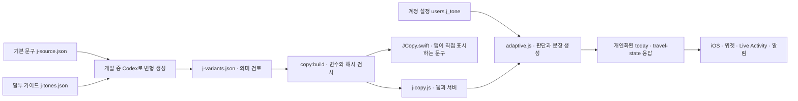

# J의 말투

개인 계정의 말투로 J의 제안·이유·일정 조정·출발 안내·한 마디·알림을 표시한다.

| 저장값 | 사용자에게 보이는 이름 | 원칙 |
| --- | --- | --- |
| FRIENDLY | 여행 메이트 · 기본 | 차분하고 친근한 해요체 |
| CASUAL | 찐친 | 재촉·놀림 없이 편한 반말 |
| POLITE | 직장 동료 | 거리감이 지나치지 않은 정중한 존댓말 |

버튼·설정·오류·공용 활동 기록은 말투 선택 대상이 아니다. 함께 여행하는 사람도 각자 자기 계정의 말투를 본다. 여행 문서와 공유 활동에 말투를 저장하지 않는다.

## 문구를 바꾸는 절차

개발자는 `copy/j-source.json`의 기본 문구만 먼저 고친다. 앱에서 직접 사용하는 키는 `local: true`로 표시한다. 식당 이름·시간·수치·조사는 `{place}`, `{minutes}` 등의 변수로 분리한다. 조사는 기존 `josa` 판정으로 계산한 뒤 변수에 넣는다.

1. `npm run copy:pending`으로 변경된 기본 문구와 현재 가이드를 확인한다. 출력의 `pending`에는 변형이 없거나 원본·가이드가 바뀐 키만 나온다.
2. 현재 Codex 세션에 이 목록을 읽히고 가이드대로 CASUAL/POLITE 두 변형을 작성하게 한다. 외부 AI API·API 키·런타임 생성은 사용하지 않는다.
3. Codex가 `copy/j-variants.json`의 해당 키에 두 문구와 출력에 포함된 `sourceHash`, `guideHash`를 저장한다. 장소·시각·조건·부정·가능성과 불확실성·선택권이 원본과 같은지 리뷰한다. 해시만 갱신해 검사를 통과시키지 않는다.
4. `npm run copy:build`로 JS/Swift 생성 결과를 갱신한다. 생성 파일을 직접 고치지 않는다.
5. `npm run copy:check` 및 관련 테스트를 실행하고 원본·변형·생성 결과·변경된 서버 픽스처를 함께 커밋한다. 웹 자산이면 `npm run bump:version`도 실행한다.

Codex에 전달할 작업 예시:

> `npm run copy:pending`을 읽고 변경된 키의 CASUAL/POLITE 문구를 생성해 주세요. 기본 문구의 사실·조건·부정·불확실성·변수와 사용자의 선택권을 보존하고 `copy/j-tones.json`을 따르세요. `sourceHash`와 `guideHash`는 출력 값을 사용하세요. 의미를 확인한 뒤 변형 파일을 갱신하고 copy:build 및 copy:check를 실행하세요.

빌드는 누락·남은 키·변수의 개수와 이름·원본/가이드 해시·생성 결과의 차이를 검사한다. 사실이나 말투의 자연스러움을 자동으로 증명하지는 못하므로 두 변형의 의미 리뷰가 필요하다. 가이드 변경은 모든 키를 재검토 대상으로 만든다.

## 계정과 기기

- `GET /api/v1/me/preferences` → `{ "jTone": "FRIENDLY" }`
- `PUT /api/v1/me/preferences` ← `{ "jTone": "CASUAL" }`
- `/api/v1/me`에도 `preferences.jTone`을 실어 웹의 기존 계정 조회에서 함께 읽는다.
- 서버는 인증한 사용자 ID로만 조회·저장한다. 요청 본문이나 여행의 멤버 설정으로 사용자를 고르지 않는다. 잘못된 enum/JSON·다른 필드는 거절한다. DB 미연결 시 읽기는 기본값, 쓰기는 MAINTENANCE를 반환한다.
- `users.j_tone`은 기본값 FRIENDLY인 nullable 컬럼 추가다. 기존 계정과 구버전 앱은 기본 말투를 계속 사용하며 이미지 롤백 시 컬럼을 삭제할 필요가 없다.
- 웹 localStorage와 iOS UserDefaults는 계정 ID별로 나눈다. 로그인·계정 전환 후 설정을 읽고, 화면 복귀와 설정 진입 시 다시 확인한다. 늦게 도착한 이전 계정의 응답은 버린다.
- 저장 실패 시 선택을 기기에 남기고 재시도 버튼을 보인다. 미저장 선택을 늦은 서버 조회로 덮어쓰지 않는다. 웹은 기기 선택으로 즉시 다시 계산한다. iOS가 캐시한 서버 문장은 온라인 응답이 갱신된 뒤 새 말투를 사용한다.
- 제안 ID·키·수락 동작·순위·예약 판단·알림 dedupeKey는 말투와 무관하다. stateVersion에는 기본값 이외 말투를 반영해 위젯과 Live Activity가 새 문장을 받는다. 기존 발송 알림은 다시 보내지 않고 이후 안내에 적용한다.

## 검증과 배포

`test/j-copy.test.js`가 원본/가이드 변경 탐지, 변수 보존, 조사, 판단과 식별자 불변을 검사한다. 서버의 `swiftParity.test.ts`가 각 말투의 실제 travel-state 응답을 세 픽스처로 만들고 `JToneTests`가 모두 디코딩한다. API·DB 테스트는 인증/입력 검증과 계정별 저장을, 웹 E2E와 iOS 저장 테스트는 선택·실패·재시도·계정 전환·늦은 응답을 검사한다.

전체 릴리스 검사는 `npm run verify:all`이다. SKIP은 통과로 처리하지 않는다. 서명·실기기 푸시와 실제 잠금 화면 표시는 기존 실기기 릴리스 체크를 따른다.

API/문구 엔진 PR을 먼저 merge하고 NAS의 새 revision과 마이그레이션·preferences 동작을 확인한 다음 웹/iOS 선택 화면 PR을 merge한다. API PR만 배포되면 모든 계정은 기본 말투이고 기존 클라이언트는 그대로 동작한다. 클라이언트 PR만 먼저 배포하지 않는다. 되돌릴 때는 클라이언트를 먼저 되돌리고 서버를 이전 이미지로 돌릴 수 있다. 추가된 컬럼과 저장값은 남겨 둔다.
